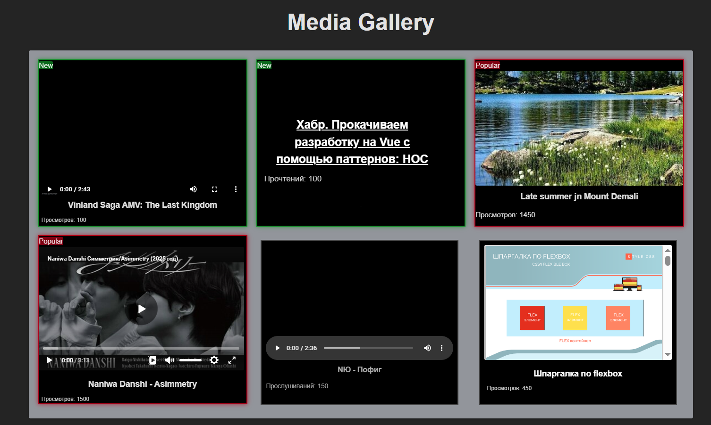

## React. Mark popular media using HOC - Media Gallery

Подсвечивание блоков со статьями и видеозаписями с использованием Higher-Order Component (HOC).

### Демонстрация на GitHub Actions


[Deploy](https://nmyurchenko-max.github.io/ra-hoc-highlight/)

### 🌐 Живая демонстрация



<video controls src="src/assets/media-gallery.mp4" title="Title" width="640" height="360"></video>

[Видео демонстрации](./src/assets/media-gallery.mp4)

Для демонстрации приложения использованы различные типы медиа: статьи, видео, аудио, изображения и PDF,
из интерната и локальных источников (src/img, src/pdf, src/video, src/audio).
В приложении используется HOC `withMediaWrapper` для обёртки медиа-компонентов,
который добавляет классы и бейджики на основе количества просмотров, дополнительно настроена обводка для популярных и новых материалов.

### 📋 Задача

[Netology.Task](https://github.com/netology-code/ra16-homeworks/blob/ra-51/hoc/highlight/README.md)

## 📁 Структура проекта

```
src/
├── components/
│   ├── Article.tsx       # Компонент для статей
│   ├── Audio.tsx         # Компонент для аудио
│   ├── Image.tsx         # Компонент для изображений
│   ├── index.ts          # Экспорты компонентов
│   ├── Pdf.tsx           # Компонент для PDF
│   ├── Video.tsx         # Компонент для видео
│   ├── withMediaWrapper.tsx  # HOC для обёртки медиа
│   └── WrappedMedia.tsx  # Обёрнутый медиа-компонент
├── dataSources/
│   ├── localData.ts      # Локальные данные
│   └── media.json        # Данные медиа
├── models/
│   └── type.ts           # Типы данных
├── assets/               # Ассеты
├── audio/                # Аудио файлы
├── img/                  # Изображения
├── pdf/                  # PDF файлы
└── video/                # Видео файлы
```

### Реализация HOC withMediaWrapper

```tsx
const withMediaWrapper = <T extends { views: number }>(
  WrappedComponent: React.ComponentType<T>
) => {
  return function MediaWrapper(props: T) {
    const { views } = props;

    // Определяем класс и бейджик на основе просмотров
    let wrapperClass = 'wrap-item-regular';
    let badgeText = '';

    if (views <= 100) {
      wrapperClass = 'wrap-item-new';
      badgeText = 'New';
    } else if (views > 1000) {
      wrapperClass = 'wrap-item-popular';
      badgeText = 'Popular';
    }

    return (
      <div className={wrapperClass}>
        {badgeText && <span className="label">{badgeText}</span>}
        {/* Передаём все пропсы, включая views */}
        {React.createElement(WrappedComponent, props)}
      </div>
    );
  };
};
```

### Логика подсветки
- **Popular**: views >= 1000
- **New**: views <= 100

### Типобезопасная архитектура:

Использование дискриминированных типов для типобезопасности и разделения логики по типам медиа.
```ts
export type MediaItem =
  | {
      id: number;
      type: 'video' | 'image' | 'audio' | 'pdf';
      src: string;
      views: number;
      title?: string;
    }
  | {
      id: number;
      type: 'article';
      href: string;
      views: number;
      title?: string;
    };
```

### Особенности

* Типобезопасная архитектура:
  Использование дискриминированных типов вместо дженериков для безопасного разделения 
  логики по типам медиа.
* Динамическая загрузка локальных файлов: Через import.meta.glob для аудио, изображений и PDF.
* Ленивая загрузка компонентов: С использованием React.lazy и Suspense для оптимизации производительности.
* Обработка ошибок и валидации: Проверки на пустые значения и обёртки для отображения ошибок.

**🛠 Технологии**
React 19 + TypeScript – Для типобезопасного кода и современных возможностей.
Vite – Быстрая сборка и разработка.
CSS Modules – Локализация стилей.
React.lazy + Suspense – Ленивая загрузка компонентов.
import.meta.glob – Динамический импорт локальных медиафайлов.
GitHub Actions – CI/CD для автоматической деплои и тестирования.

## Использование

```bash
# Клонирование репозитория
clone https://github.com/NMYurchenko-max/ra-hoc-highlight.git

# Установка зависимостей
cd ra-hoc-highlight
yarn install

# Запуск в режиме разработки
yarn dev

# Сборка для продакшена
yarn build

# Предпросмотр сборки
yarn preview

# Запуск тестов
yarn test

# Проверка типов
yarn typecheck

# Линтинг
yarn lint
```

##  🔐Лицензия

ISC © N. Yurchenko

[Лицензия ISC](LICENSE)

## ⚠️ PS: Ограничения и планы улучшений

1. VK Music / Yandex Music: Не протестированы из-за региональных ограничений и недоступности API.
1. В `React-player` начиная с v3 API изменился: пропса url больше нет,
вместо него используется src и внутри пакет имеет свои типы.
2. YouTube в России не работает, возможно поэтому его ссылки сбрасываются.
3. Локальные медиа: Работают через import.meta.glob, но требуют правильного пути в media.json.
**Планы:**
Разобраться с размерностью неотмеченных медиа.
Добавить поддержку загрузки медиа из облаков (Google Drive, Dropbox).
Реализовать кэширование просмотров через localStorage.
Улучшить визуализацию для PDF и аудио.
🙏 Если вы столкнулись с похожими проблемами или знаете решения — поделитесь опытом!
Это станет основой для будущих улучшений.
---
